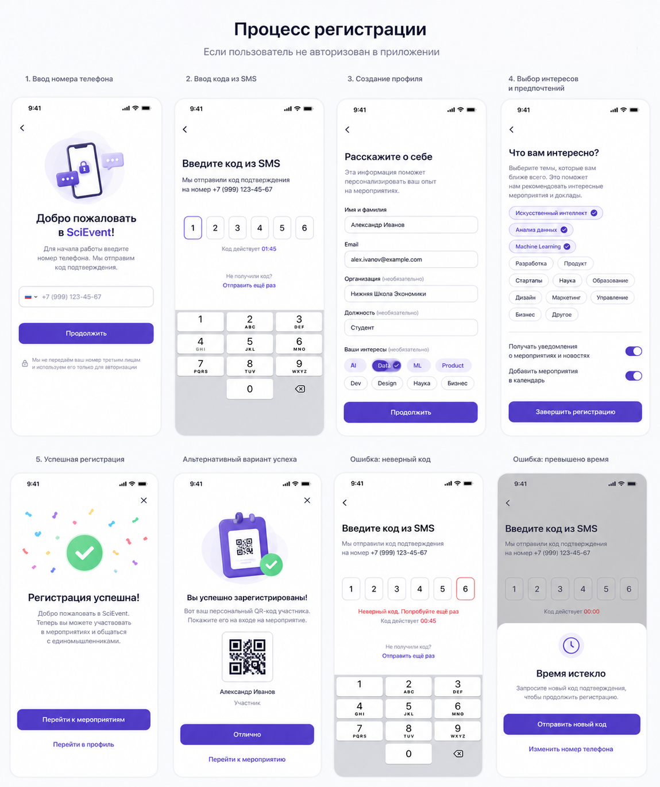

# B2C-6: Экран успеха — `SuccessScreen`

**Пакет:** `@sci-event/b2c`
**Приоритет:** 🟡 Средний

## Дизайн-референс

> Экраны: **5. Успешная регистрация** (нижний ряд, первый слева) и **Альтернативный вариант успеха** с QR-кодом (нижний ряд, второй)

## Описание
Экран после успешного завершения регистрации. Показывает подтверждение и предлагает перейти к мероприятиям или профилю.

## Файлы
```
frontend/apps/b2c/src/pages/Registration/screens/
├── SuccessScreen.tsx
└── SuccessScreen.module.css
```

## Props
```ts
type SuccessScreenProps = {
  onGoToEvents: () => void;
  onGoToProfile: () => void;
  onClose: () => void;
};
```

## Компоненты и структура
```tsx
<div className={styles.root}>
  <Button iconOnly variant="ghost" iconName="X" onClick={onClose} className={styles.close} />
  <Picture name="g320_check" size={200} />
  <Text as="h1" size="xxl" weight="bold">Регистрация успешна!</Text>
  <Text color="neutral-500">Добро пожаловать в SciEvent. Теперь вы можете участвовать в мероприятиях и общаться с единомышленниками.</Text>
  <Button variant="primary" onClick={onGoToEvents}>Перейти к мероприятиям</Button>
  <Button variant="ghost" onClick={onGoToProfile}>Перейти в профиль</Button>
</div>
```

## Поведение
- Кнопка X (закрыть) в правом верхнем углу — закрывает весь SheetStack (`closeAll()`)
- Центрированный layout, конфетти-иллюстрация сверху

## Связи
- Используется в: `B2C-8` (`Registration`)
